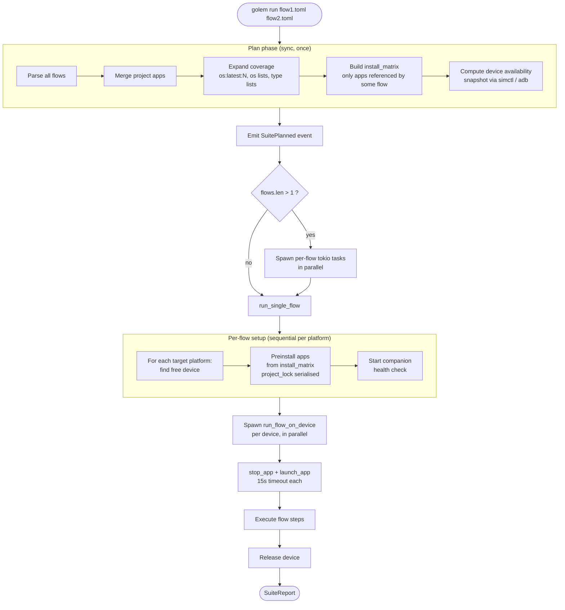
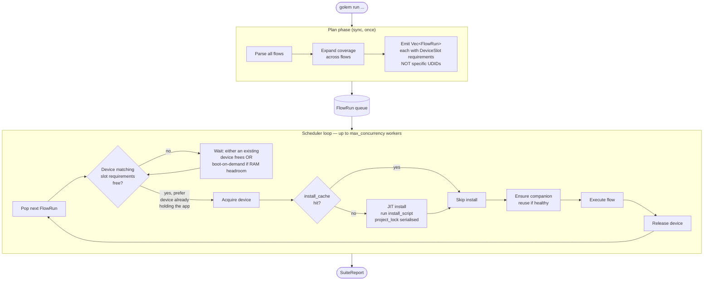

# Golem

Cross-platform mobile UI testing framework. Write tests once in TOML, run on iOS and Android simultaneously.

## Quick Start

```bash
# Initialize a project
golem init

# Create a test flow
golem create login

# Scaffold an install script for your app (native-ios, native-android, tauri)
golem install-script

# Run tests
golem run flows/login.test.toml

# Run all flows in a directory
golem run flows/

# List connected devices
golem devices

# Inspect the live UI tree
golem tree
```

## CLI Reference

### `golem run`

Run one or more test flows.

```bash
golem run [FILES...] [OPTIONS]
```

**Arguments:**

| Argument | Description |
|----------|-------------|
| `FILES...` | Flow files or directories. If empty, auto-discovers from current directory. |

**Options:**

| Flag | Description |
|------|-------------|
| `--platform <ios\|android>` | Force a single platform (overrides flow device config) |
| `--tag <TAG>` | Filter flows by tag. Repeatable. Use `\|` within a value for OR. |
| `--var <KEY=VALUE>` | Set a variable (highest priority, overrides flow vars). Repeatable. |
| `--output <FORMAT>` | Stdout format: `human` (default), `json`, `junit`, `toon`. Repeatable. |
| `--output-dir <PATH>` | Results directory (default: `.golem/results`). JSON + toon always written. |
| `--no-results` | Disable all file output (screenshots, recordings, reports) |
| `--seed <N>` | Deterministic seed for fake data generation. Seed shown in all output formats for reproducibility. |
| `--start <BLOCK>` | Start execution at a named block (skips app lifecycle, assumes app in correct state) |
| `--max-concurrency <N>` | Max parallel devices (not yet implemented) |
| `--record` | Enable auto screen recording (not yet implemented) |
| `--no-clean` | Skip app data clear between flows (not yet implemented) |
| `--no-teardown` | Skip teardown blocks (not yet wired) |
| `--keep-devices` | Keep devices running after completion (not yet wired) |
| `--no-perf` | Disable performance capture |
| `--rebuild` | Bypass the persistent install cache for this run (rebuild + reinstall every app on every device). Cache is still written after a successful build, so the next run benefits. |
| `--no-build` | Skip build+install entirely. If the device already has the bundle, golem trusts it and runs flows; if not, the flow fails loudly. The cache is left untouched. Use when iterating on flow files against a known-good binary. |
| `--verbose` | Show substeps (scroll coordinates, strategies, tree stats) + plan summary (flow runs, install matrix, device availability) + cache hits/misses |
| `--debug` | Show driver diagnostics (WebKit/CDP) and per-line install-script stderr |

**Examples:**

```bash
# Run on Android only
golem run flows/ --platform android

# Run with variables
golem run flows/login.test.toml --var EMAIL=test@example.com --var PASSWORD=secret

# Multiple output targets
golem run flows/ --output json --output junit   # json+junit to stdout, all results to .golem/results/

# Filter by tag
golem run flows/ --tag smoke
golem run flows/ --tag "auth|login"

# Verbose mode for debugging scroll behavior
golem run flows/scroll.test.toml --verbose
```

### `golem tree`

Inspect the live UI element hierarchy from a running device.

```bash
golem tree [OPTIONS]
```

| Flag | Description |
|------|-------------|
| `--platform <ios\|android>` | Filter by platform |
| `--device <NAME>` | Filter by device name or UDID (substring match) |
| `--bundle <ID>` | App bundle ID (default: `fail.golem.test`) |
| `--full` | Show full tree without viewport filtering |
| `--json` | Output as JSON |
| `--verbose` | Show metadata: CDP status, enrichment, keyboard, safe area |

### `golem devices`

List all connected simulators, emulators, and physical devices.

### `golem init`

Scaffold a new project: creates `golem.toml`, `flows/`, `__fixtures__/`, `__mixins__/`, and `.golem/`.

### `golem create <name>`

Create a new flow template at `flows/<name>.test.toml`.

### `golem install-script`

Interactively scaffold an install script for an app in your project. Prompts for framework (native-ios, native-android, tauri), the relevant build config (xcode project/scheme, gradle root/module, tauri CLI runner), discovers candidates automatically where possible, and writes a bash script under `scripts/`. Optionally updates `golem.toml` with a matching `[[apps]]` entry so flows inherit the script by name.

See [App Install](#app-install) below for the full resolution and execution model.

---

## Output Formats

Specify with `--output FORMAT[:FILE]`. Multiple formats can run simultaneously.

### `human` (default)

Real-time colored output streamed to stderr. Shows step-by-step progress with timing, pass/fail symbols, and a suite summary.

```
▶ tap.test
  ── tap_interactions ──
  [1][tap_interactions][0] tap on_text="+"
      ✓  [1200ms]
  [2][tap_interactions][1] assert_visible on_text="1" on_below="Counter"
      ✓  [320ms]

  ✓ PASSED  tap.test  [2.1s]
```

Step labels read as `[global_step][block_name][step_within_block]`. With data-driven tests or `for_each` iterations, the block name includes the iteration: `[3][login:0][1]`, `[6][login:1][1]`.

With `--verbose`, shows substeps and tree stats. The `{3 trees, 186~190 nodes}` suffix shows how many UI hierarchy fetches the step needed and the node count range across those fetches. Higher tree counts indicate retries or scroll iterations; changing node counts suggest the UI was updating.

Scroll substeps show the strategy number (1-5 per direction), swipe coordinates, and outcome. Strategies vary the swipe distance and position to handle different scroll contexts — strategy 1 is a full-page swipe, higher numbers try shorter or offset swipes to handle inner scrollable containers.
```
  [3][tap_interactions][2] tap on_text="+"
      ∙ element_resolved "+" bounds=(48,161,43,36) tap=(69,179)
      ∙ tap (69,179)
      ✓  [2126ms] {3 trees, 186~190 nodes}
  [5][scroll_test][1] read on_right_of="Orientation:" auto_scroll
      ∙ [scroll] ↓ strategy 1 (540,1560)→(540,256) → page scrolled
      ∙ [scroll] ↓ strategy 2 (540,2160)→(540,840) → found at (550,459)
      ∙ element_resolved "Portrait" bounds=(200,459,80,18) tap=(240,468)
      ✓  [8234ms] {3 trees, 187~188 nodes}
```

### `json` or `json:<file>`

Structured JSON with suite summary, per-flow results, step details, substeps, and performance snapshots. Without a file path, outputs to stdout.

### `junit` or `junit:<file>`

JUnit XML for CI systems (Jenkins, GitHub Actions, GitLab CI). Each flow maps to a `<testsuite>`, each step to a `<testcase>`. Without a file path, outputs to stdout.

### `toon`

Token-optimized format for LLM analysis. ~40-60% smaller than human format.

```
S:tap_test d:450 seed:847291036
 +tap:+ 45 t:3/142
 +assert_visible:1 120
R:PASS 2/0/0
```

---

## Test Structure

Tests are written in TOML. A `.test.toml` file defines a **flow** — the top-level unit of execution.

### Flow

A flow is a complete test scenario: metadata, app configuration, device targets, execution blocks, and optional teardown.

```toml
[flow]
name = "Login test"
tags = ["auth", "smoke"]
# start = "block_name"  # Optional: skip to this block (assumes app in correct state)

[[flow.apps]]
name = "app"
bundle = "com.example.myapp"

[[flow.apps.devices]]
os = "ios:latest"
type = "phone"

[[flow.apps.devices]]
os = "android:latest"
type = "phone"

[[block]]
name = "login"
steps = [
  { action = "type", on_text = "Email", input = "user@example.com" },
  { action = "type", on_text = "Password", input = "secret" },
  { action = "tap", on_text = "Sign In" },
  { action = "assert_visible", on_text = "Dashboard", timeout = 10000 },
]
```

The flow runs on every device listed. Golem launches the first app automatically before executing blocks.

#### Flow Options

```toml
[flow.options]
step_timeout = 5000                 # Base timeout (ms), default: 5000. See timeout multipliers below.
max_steps = 10000                   # Safety limit
max_runtime = "30m"                 # "5m", "2h", "500ms"
app_lifecycle = "reset"             # "reset" (default), "launch", "manual"
screenshot_on_failure = true        # Auto-capture screenshot on step failure (default: true)
record = true                       # Not yet wired
coverage = "smart"                  # "smart" (default), "min", "full", "one" — see Coverage strategies
perf = true                         # Performance monitoring (default: true)
perf_memory_warn_mb = 200.0
perf_memory_error_mb = 500.0
perf_cpu_warn_percent = 80.0
perf_cpu_error_percent = 95.0
```

#### Coverage strategies

`coverage` controls how multi-valued `[[flow.apps.devices]]` axes expand into FlowRuns.

| Strategy | Behaviour |
|---|---|
| `smart` (default) | Plan-time set-cover picks fully-pinned slots; a shared coverage group lets the scheduler stop dispatching members once every axis value has been ticked (including bonus ticks — an iPad v26 ticks both the `tablet` and `ios:26` boxes). |
| `min` | Plan-time greedy set-cover — fewest devices that tick every axis value. Every emitted FlowRun runs; no early-stop. |
| `full` | Cartesian product — one FlowRun per (os × type × …) combination. Use when every combo needs independent validation. |
| `one` | Same machinery as `smart` with `max_runs = 1`: first successful run ends the group. Local smoke testing. Tolerates underspec (`ios:latest:2` with only one version available). |

**Two ways to write device constraints**, with different meanings:

*Multi-block form — pinned tuples.* Each `[[flow.apps.devices]]` is an independent combination that must run.

```toml
[[flow.apps.devices]]
os = "ios:26"
type = "tablet"

[[flow.apps.devices]]
os = "android:34"
type = "phone"
```

This guarantees **both specific combinations**: an iPad v26 AND an Android phone v34.

*Single-block array form — independent axes.* Each axis value is a coverage point; Golem ticks every value but doesn't care how the combos fall out.

```toml
[[flow.apps.devices]]
os = ["ios:26", "android:34"]
type = ["tablet", "phone"]
```

This guarantees **every axis value runs somewhere**. Under `smart`/`min` two devices cover all four boxes — could be iPad v26 + Android phone v34, or iPhone v26 + Android tablet v34. Under `full` it emits four fully-pinned combinations.

**When the forms are equivalent.** If each block has at most one multi-valued axis (typically when `type` is absent or single-valued and identical across all blocks), the two forms produce the same boxes:

```toml
# Multi-block
[[flow.apps.devices]]
os = "ios:latest"
type = "phone"
[[flow.apps.devices]]
os = "android:latest"
type = "phone"

# Array form (equivalent — recommended for compactness)
[[flow.apps.devices]]
os = ["ios:latest", "android:latest"]
type = "phone"
```

Both emit two fully-pinned boxes `{ios, latest, phone}` + `{android, latest, phone}` under every strategy. Prefer the array form when it captures the same intent.

**No `[[flow.apps.devices]]` block at all.** Golem runs on whatever platform is currently booted (both if both are booted). Virtual-only (sim/emulator) by default — physical devices are never picked implicitly. Fails fast if nothing is booted.

##### Hardware axis (virtual / real)

```toml
[[flow.apps.devices]]
# (hardware omitted)                # default: virtual-only (sim/emulator)

[[flow.apps.devices]]
hardware = "virtual"                # explicit: virtual-only

[[flow.apps.devices]]
hardware = "real"                   # physical device required

[[flow.apps.devices]]
hardware = ["virtual", "real"]      # coverage axis — both tick boxes emitted
```

Physical devices require **explicit opt-in** via `hardware = "real"`. The default is virtual-only so an accidentally-connected phone doesn't get swept into a flow it wasn't meant for.

Under `coverage = "one"` / `"smart"`, `hardware = ["virtual", "real"]` gives graceful degradation: the sim box usually succeeds first, the physical box is skipped via the coverage gate. If you want to *insist* on physical, use `hardware = "real"` on its own.

`hardware = "real"` + `create_if_missing = true` errors out — physical hardware cannot be auto-created.

##### Pinning a specific device by name

```toml
[[flow.apps.devices]]
name = "iPhone 15"
```

`name` pins an exact device display name (as shown by `golem devices` / `xcrun simctl list` / `adb devices -l`). Use this when you have a customised simulator or a specific physical device the flow must target.

Under `create_if_missing = true`, a slot with `name = ...` that doesn't match any connected/booted device errors with an actionable message instead of auto-creating a mis-named sim — `name` is a user assertion that the device already exists; golem won't guess its configuration.

##### Auto-boot behaviour

When a slot's requirement matches a device that is **shutdown** (no booted match, but a compatible AVD/sim exists), golem boots it automatically and waits for it to be fully ready before continuing. The readiness gate is per-platform:

- **iOS**: `xcrun simctl boot` then `xcrun simctl bootstatus -b` blocks until the sim reports `Booted` with system services up. Typical: 10-25s for a cold boot.
- **Android**: `emulator -avd <id> -no-window -no-audio` spawned detached, then `adb wait-for-device` + poll `getprop sys.boot_completed` until `"1"`. Typical: 60-120s for a cold boot.

**Android emulators always run headless** (`-no-window -no-audio` is hardcoded). Even if you have Android Studio's emulator UI open separately, golem-booted emulators have no GUI window. Useful for CI; if you want to *see* the emulator during local debugging, boot it manually via Android Studio first — golem will reuse the booted device instead of starting another headless one.

iOS sims are headless from `simctl boot` by default, but if you have `Simulator.app` open, it'll attach automatically and show the booted sim. So iOS gives you visibility for free when you want it; Android requires you to boot externally.

#### Performance Monitoring

Golem captures app performance metrics after each block (unless `--no-perf` or `perf = false`). Metrics are collected from the device via platform tools and the companion app.

| Metric | Unit | Source |
|--------|------|--------|
| Memory | MB | `dumpsys meminfo` (Android), `footprint_in_bytes` (iOS) |
| CPU | % | `dumpsys cpuinfo` (Android), `cpu_usage` (iOS) |
| Threads | count | `/proc/<pid>/status` (Android), `threadCount` (iOS) |
| File descriptors | count | Companion `/perf` endpoint |
| Disk | MB | Companion `/perf` (Android), `du -sk` (iOS) |
| Network RX/TX | KB | Companion `/perf` (Android), `netstat` (iOS) |

Thresholds in `[flow.options]` trigger warnings or failures:

```toml
perf_memory_warn_mb = 200.0     # Warn if memory exceeds 200 MB
perf_memory_error_mb = 500.0    # Fail if memory exceeds 500 MB
perf_cpu_warn_percent = 80.0    # Warn if CPU exceeds 80%
perf_cpu_error_percent = 95.0   # Fail if CPU exceeds 95%
```

Performance data appears in all output formats: human (table), JSON (objects), JUnit (properties), toon (abbreviated codes).

### Block

Blocks group steps into logical sections. They execute in document order by default.

```toml
[[block]]
name = "setup"
steps = [
  { action = "assert_visible", on_text = "Welcome", timeout = 30000 },
]

[[block]]
name = "main_test"
steps = [
  { action = "tap", on_text = "+" },
  { action = "tap", on_text = "+" },
  { action = "assert_visible", on_text = "2", on_below = "Counter" },
]
```

#### Platform-Specific Blocks

Skip blocks that don't apply to the current device:

```toml
[[block]]
name = "android_back"
where = { os = "android" }
steps = [
  { action = "press", button = "back" },
]
```

#### Branching

Control flow between blocks with conditions:

```toml
[[block]]
name = "check_state"
steps = [
  { action = "assert_visible", on_text = "Welcome", if_fail = "ignore" },
]

[[block.branch]]
if_visible = "Dashboard"
goto = "already_logged_in"

[[block.branch]]
goto = "login_required"            # Unconditional fallback
```

Branch conditions: `if_visible`, `if_not_visible`, `if_var` + `equals`/`matches`/`gte`.

#### Block `next`

Jump to a named block after completion (instead of falling through):

```toml
[[block]]
name = "step_a"
next = "step_c"
steps = [...]

[[block]]
name = "step_b"
steps = [...]    # Skipped

[[block]]
name = "step_c"
steps = [...]    # Executed after step_a
```

### Step

A step is a single action with optional selectors, timeouts, and error handling.

```toml
{ action = "tap", on_text = "Submit" }
{ action = "assert_visible", on_text = "1", on_below = "Counter", timeout = 5000 }
{ action = "type", on_text = "Email", input = "hello@example.com" }
{ action = "read", on_right_of = "Status:", save_to = "status_value" }
```

#### Selectors

Find elements by visible text, accessibility labels, position, or state:

| Selector | Description |
|----------|-------------|
| `on_text` | Match by visible text (glob pattern, case-insensitive) |
| `on_accessibility_label` | Match by accessibility identifier |
| `on_index` | Match the Nth element (0-based) |
| `on_enabled` | Filter by enabled state (`true`/`false`) |
| `on_checked` | Filter by checked state (`true`/`false`) |
| `on_clickable` | Filter by clickability |
| `on_below` | Element must be below this anchor text |
| `on_above` | Element must be above this anchor text |
| `on_right_of` | Element must be right of this anchor text |
| `on_left_of` | Element must be left of this anchor text |

#### Grouped Selector Syntax

For complex queries, use `on = {}` instead of flat `on_*` fields:

```toml
# Flat (simple cases)
{ action = "tap", on_text = "Submit", on_below = "Counter" }

# Grouped (complex selectors, nested anchors)
{ action = "tap", on = { text = "Submit", below = "Counter", enabled = true } }

# Nested anchor with its own selectors
{ action = "assert_visible", on = { text = "Portrait", right_of = { text = "Orientation:" } } }

# Traits filtering
{ action = "assert_visible", on = { text = "Submit", traits = ["button", "has_text"] } }
```

#### Step Options

| Field | Default | Description |
|-------|---------|-------------|
| `timeout` | per-action | Max wait in ms. Overrides computed default. |
| `auto_scroll` | `false` | Scroll page to find element |
| `max_scrolls` | — | Limit scroll attempts |
| `if_fail` | `"error"` | `"error"` (fail flow), `"warn"` (log + continue), `"ignore"` (silent continue) |
| `retry` | `0` | Retry count on failure |
| `retry_delay` | `1000` | Delay between retries (ms) |
| `save_to` | — | Save result to a variable |
| `app` | — | Target a specific app (for multi-app flows) |

#### Timeout Multipliers

Each action has a built-in multiplier applied to the base timeout (`step_timeout`, default 5000ms). Per-step `timeout` always overrides. `auto_scroll = true` forces 6x minimum.

| Multiplier | Timeout (at 5s base) | Actions |
|------------|---------------------|---------|
| 1x | 5s | `tap`, `doubleTap`, `backspace`, `long_press`, `swipe`, `pinch`, `gesture`, `press`, `rotate`, `screenshot`, `hide_keyboard`, device controls |
| 2x | 10s | `type`, `assert_visible`, `assert_checked`, `assert_not_visible`, `wait`, `wait_not`, `read`, alerts |
| 3x | 15s | `launch`, `stop` |
| 4x | 20s | `bash`, `run` |
| 6x | 30s | `scroll`, `auto_scroll`, `http_*`, `open_link` |
| 48x | 240s | `await_email` |

Actions with intrinsic duration (`long_press`, `type`, `rotate`, `gesture`) auto-extend: `max(multiplied, duration + 2s)`. For `type`, duration is ~200ms per character.

### Subflow

Delegate a block to a child flow file. The child inherits parent variables and device context.

```toml
# parent.test.toml
[[block]]
name = "increment"
run_flow = "subflows/increment_counter.test.toml"

[block.save_to]
counter_value = "result_after_increment"
```

```toml
# subflows/increment_counter.test.toml
[flow]
name = "Increment counter"

[flow.options]
app_lifecycle = "manual"    # Don't restart the app

[[block]]
steps = [
  { action = "tap", on_text = "+" },
  { action = "read", on_below = "Counter", on_index = 0, save_to = "counter_value" },
]
```

Variables listed in `[block.save_to]` propagate back to the parent. Override child variables with `[block.vars]`.

### Teardown

> **Not yet wired.** Teardown blocks are parsed but not executed. This section describes the intended behavior.

Teardown blocks run after the flow completes, regardless of pass/fail. Failures in teardown don't affect the test result.

```toml
[[teardown]]
steps = [
  { action = "screenshot", path = "/tmp/final.png" },
  { action = "stop", app = "app" },
]
```

Skip teardown with `--no-teardown`.

### Data-Driven Tests

Run the entire flow once per data row:

```toml
[[data]]
username = "alice"
password = "pass1"

[[data]]
username = "bob"
password = "pass2"

[[block]]
steps = [
  { action = "type", on_text = "Email", input = "${username}" },
  { action = "type", on_text = "Password", input = "${password}" },
  { action = "tap", on_text = "Login" },
]
```

### Variables

Set variables from the CLI, flow metadata, data rows, `read` actions, or fixtures:

```bash
golem run flows/login.test.toml --var EMAIL=test@example.com
```

```toml
[flow.vars]
base_url = "https://staging.example.com"

[[block]]
steps = [
  { action = "read", on_right_of = "Status:", save_to = "current_status" },
  { action = "bash", run = "echo ${current_status}", save_to = "result" },
]
```

### Fake Data Generators

Generate realistic test data with the `fake:` prefix in variable declarations. Generators produce random but valid values. Use `--seed <N>` for deterministic replay.

```toml
[flow.vars]
email = "fake:email"
user = "fake:person(country=JP)"
addr = "fake:address(country=GB)"
card = "fake:credit_card(brand=visa)"
```

Access structured fields with dot notation: `${user.name}`, `${addr.city}`, `${card.number}`.

#### Simple generators

| Generator | Output | Parameters |
|-----------|--------|------------|
| `fake:email` | `abc123@example.com` | `prefix`, `domain` |
| `fake:first_name` | Random first name | — |
| `fake:last_name` | Random last name | — |
| `fake:password` | Random password | `length` (default 12), `symbols` (default true) |
| `fake:uuid` | UUID v4 | — |
| `fake:number` | Random integer string | `min` (default 0), `max` (default 100) |
| `fake:sentence` | Simple English sentence | — |
| `fake:timestamp` | ISO 8601 within last year | — |
| `fake:phone` | Country-formatted phone | `country` (ISO code), `format` (`#` = digit) |
| `fake:city` | City name | `country`, `region` |
| `fake:postcode` | Postal code | `country` |
| `fake:street` | Street address | `country` |

#### Structured generators

These return objects with multiple fields.

**`fake:person`** — `country` parameter affects name ordering and phone format.

| Field | Example |
|-------|---------|
| `first` | Yuki |
| `last` | Tanaka |
| `name` | Tanaka Yuki (family-first for JP/CN/KR) |
| `email` | yuki.tanaka@example.com |
| `phone` | +81-90-1234-5678 |

**`fake:address`** — Parameters: `country`, `state`, `region`.

| Field | Example |
|-------|---------|
| `street` | 42 Baker Street |
| `city` | London |
| `state` | England |
| `postcode` | SW1A 1AA |
| `country` | United Kingdom |
| `country_code` | GB |

**`fake:credit_card`** — Generates Luhn-valid card numbers. Parameters: `brand` (visa/mastercard/amex/discover), `provider` (stripe/adyen/square/etc.), `status`.

| Field | Example |
|-------|---------|
| `number` | 4532015112830366 |
| `expiry` | 03/28 |
| `cvv` | 123 |
| `brand` | visa |
| `status` | (empty if approved) |

Status options without provider: `approved`, `declined:invalid_number`, `declined:expired`, `declined:invalid_cvv`, `threeds`. Provider-specific statuses vary.

#### Cross-references

Later generators can reference earlier variables:

```toml
[flow.vars]
addr = "fake:address(country=JP)"
phone = "fake:phone(country=${addr.country_code})"
person = "fake:person(country=${addr.country_code})"
```

### Multi-App Flows

Test interactions across multiple apps:

```toml
[[flow.apps]]
name = "app"
bundle = "com.example.main"

[[flow.apps]]
name = "companion"
bundle = "com.example.companion"

[[block]]
steps = [
  { action = "tap", on_text = "+" },
  { action = "launch", app = "companion" },
  { action = "assert_visible", on_text = "Shared Data" },
  { action = "launch", app = "app" },
  { action = "stop", app = "companion" },
]
```

`launch` brings an app to foreground without restarting it. Use `restart = true` for a cold start.

---

## App Install

By default golem assumes the app under test is already installed on the target device. For fresh simulators, CI pipelines, or teams that want per-test builds, you can supply an install script that golem runs before each flow.

### Quick start

```bash
golem install-script      # interactive: choose framework, answer prompts
```

The scaffold writes `scripts/install-<app>-<platform>.sh` (for native iOS/Android) or `scripts/install-<app>.sh` (for cross-platform frameworks like Tauri) and can auto-update `golem.toml`.

### Project-level `[[apps]]` registry

Declare each app once in `golem.toml`. Flows reference by `name` and inherit everything else:

```toml
# golem.toml
[[apps]]
name = "app"
bundle = "com.example.app"
install_script = { ios = "scripts/install-app-ios.sh", android = "scripts/install-app-android.sh" }
install_timeout_ms = 900000   # optional override (default 600000 = 10 min)
```

```toml
# flow.test.toml
[[flow.apps]]
name = "app"       # inherits bundle + install_script + install_timeout_ms from [[apps]]

[[flow.apps.devices]]
os = "ios:latest"
type = "phone"
```

Flow-level fields override project-level ones when both are set.

### `install_script` forms

Either a single path (cross-platform):

```toml
install_script = "scripts/install.sh"
```

Or a platform-keyed table (native separate iOS + Android builds):

```toml
install_script = { ios = "scripts/install-ios.sh", android = "scripts/install-android.sh" }
```

Golem picks the right entry for the target platform at run time.

### Script contract

Golem invokes the script from the project root with three positional args:

```
script.sh <platform> <device_udid> <bundle_id>
```

- `platform`: `"ios"` or `"android"`
- `device_udid`: simulator UDID / emulator serial / physical device identifier
- `bundle_id`: from `[[apps]]` or `[[flow.apps]]`

Exit 0 = success, golem launches the app. Nonzero = flow fails with the script's stderr captured; subsequent flows using the same `(device, bundle)` pair are skipped.

Stdout is discarded. Stderr is streamed live via the event system and shows up in:

- Human output: `[install <app>]` prefix
- `results.json` / `results.toon` / `results.xml`: under the top-level `installs` list, with success/duration/exit_code/error

Scripts also support a 4th `"install-only"` arg for manual dev-iteration (skip build, reuse previous artifact). Golem currently always passes empty; see the roadmap for the future build-once-install-many optimisation.

### Install cache

Two layers of caching, both transparent in the default mode:

**In-memory (per suite)** — keyed on `(device_udid, bundle_id)`. Within a single `golem run`, the script runs at most once per combination.

- `Succeeded` → subsequent flows on the same device skip the script and go straight to launch
- `FailedScript` / `FailedNoScript` → subsequent flows using that combo are **skipped** with a clear reason (no repeated retries on broken setups)

**Persistent (cross-run)** — `.golem/install-cache.json`, keyed `(udid, bundle)` → `{ fingerprint, device_install_time, installed_version, installed_at }`. Subsequent `golem run` invocations skip both build AND install when **all three** integrity gates pass:

1. **Device-present** — device reports the bundle as installed (`xcrun simctl get_app_container` / `adb shell pm path`)
2. **Install-time matches** — device's bundle mtime / `lastUpdateTime` matches the cached `device_install_time`. Catches external reinstalls (Xcode "Run", manual `simctl install`)
3. **Fingerprint matches** — current source fingerprint equals the cached one. Tier 1: `git rev-parse HEAD` + sha1 of `git status --porcelain`. Tier 2 (non-git): content hash of the project tree honouring `.gitignore`

Any gate failing → cache miss, normal build+install runs, fresh entry written.

**On hit** the live stream prints `skipped (cache hit)` — terse. A hit always means **all three gates passed**; the source-fingerprint identity is implied (you almost always know what state your tree is in already, so listing it on every hit is noise).

**On miss** the stream prints a specific reason so you can see *why* a build was triggered. Examples:

- `cache miss on iPhone 17 — source fingerprint changed (git:abc → git:def)` — you committed / edited code (label shows clean→dirty or rev→rev movement)
- `cache miss on iPhone 17 — device install-time differs (... — external reinstall?)` — Xcode "Run", manual `simctl install`, or another tool replaced the binary
- `cache miss on iPhone 17 — bundle no longer installed on device` — sim was reset / app was uninstalled
- `cache miss on iPhone 17 — fingerprint unavailable (no git, no readable source tree)` — neither tier could compute a fingerprint (extremely rare)

The "no prior cache entry" case (first-time install on a fresh checkout) is silent — that's the normal path on a cold cache, not a cache invalidation worth flagging.

Where the label *does* render (in fingerprint-changed misses): clean trees show just the rev (`git:abc1234`); dirty trees include a 4-char porcelain-hash suffix (`git:abc1234+0a1b`) so two dirty trees with the same commit but different uncommitted edits render distinctly.

### Cache flags: `--rebuild` and `--no-build`

Two flags control cache behaviour. Default (no flag) = strict mode: read cache, skip on full gate match, write after build.

**`--rebuild`** — force a fresh build for this run. Bypasses cache reads so every `(device, bundle)` is rebuilt + reinstalled. The cache is **still written** after a successful build, so the next run benefits. Use when:

- A flaky build produced a bad binary and you want to start clean
- You suspect the cache is wrong but don't want to manually delete it
- You're verifying a CI build matches what local develops

```bash
golem run flows/ --rebuild
```

**`--no-build`** — skip build+install entirely. The cache is **not consulted and not written**. For each `(device, bundle)`:

- Device has the bundle → flow runs against the existing binary
- Device missing the bundle → flow fails immediately with `--no-build: <bundle> not installed on <device>; drop --no-build or install manually`

Use when:

- Iterating on flow files only — the binary hasn't changed and you want to skip even the ~150ms cache check
- You built manually via Xcode / Android Studio and want golem to test against that

```bash
golem run flows/ --no-build
```

**Both passed** — `--no-build` wins; golem emits a warning. The two intents are mutually exclusive (force rebuild vs trust device), so passing both is almost always a mistake.

### When no `install_script` is configured

If an app has no `install_script` field in `golem.toml` or its flow file, golem behaves like a permanent `--no-build` for that app: no install runs, the flow goes straight to `launch`. The two paths converge on the success case but differ on the failure mode:

| Scenario | App present | App absent |
|---|---|---|
| **No `install_script` in TOML** | launches, runs flow | `launch` errors at runtime, cache marks `FailedNoScript`, subsequent flows skip with that reason |
| **`--no-build` flag** | mark `Succeeded` upfront, runs flow | flow fails immediately with an actionable hint to drop the flag |

So if your project has no install scripts anywhere, `--no-build` is redundant — golem already assumes the apps are preinstalled. The flag earns its keep when scripts *are* configured and you want to bypass them temporarily.

### Frameworks the scaffold supports

- **native-ios** — xcodebuild + `xcrun simctl install` (simulator) / `xcrun devicectl` or `ios-deploy` (physical)
- **native-android** — `./gradlew :<module>:installDebug` (routes to any connected device via `ANDROID_SERIAL`)
- **tauri** — `tauri ios build` / `tauri android build` then install. Detects package manager from lockfiles (`npm` / `yarn` / `pnpm` / `bun` / `cargo tauri`).

Scripts are plain bash — customise freely after scaffolding. Extend to other frameworks (Expo, React Native, Flutter, Capacitor, etc.) by hand.

---

## Orchestration

Golem orchestrates a suite run in two phases: a **Plan** phase that parses flows and computes what needs to happen, and an **Execute** phase that runs flows on devices. The Plan phase is pure and idempotent; the Execute phase is async and interacts with devices, companions, and install scripts.

### How it works today



**Pain points today** (captured as roadmap items):

- Flow execution on iOS waits for Android install + companion, even though iOS is already ready.
- Install runs eagerly for every matching `(device, app)` in the matrix — not always needed.

### How it should work (target)



**Wins over the current model:**

- iOS FlowRuns start as soon as iOS is ready — no waiting for Android setup.
- A suite of 20 FlowRuns on 5 `ios:26` sims runs 5 in parallel, and next 15 reuse the same sims as they free — install runs at most 5 times total.
- Multi-device flows (chat-test, `ios:latest:2`) fall out naturally: each FlowRun has one or more `DeviceSlot` entries; scheduler acquires all of them before executing.
- Scheduler is the one place where cross-process coordination, boot-on-demand, and fair-share queueing all live — existing roadmap items plug in cleanly.

See `docs/roadmap.md` → **Dynamic JIT Scheduler — Device Reuse, Lazy Install** for the implementation plan.

---

## Actions Reference

### Interaction

#### `tap` — Tap an element

Find an element matching the selectors and tap its center.

```toml
{ action = "tap", on_text = "Submit" }
{ action = "tap", on_text = "+", timeout = 5000 }
{ action = "tap", on = { text = "OK", below = "Confirm?" } }
{ action = "tap", on_accessibility_label = "Increment" }
```

Supports all selectors, `auto_scroll`, `timeout`, `if_fail`, `retry`.

#### `doubleTap` — Double-tap an element

Two rapid taps (40ms apart) at the element center.

```toml
{ action = "doubleTap", on_text = "Zoom" }
```

Same selectors and options as `tap`.

#### `type` — Type text into an element

Taps the element to focus it, then types the `input` string.

```toml
{ action = "type", on_text = "Email", input = "user@example.com" }
{ action = "type", on_text = "Search", input = "${query}" }
```

| Field | Description |
|-------|-------------|
| `input` | Text to type. Supports `${variable}` interpolation. |

#### `backspace` — Delete characters

Taps the element to focus, then sends backspace key presses.

```toml
{ action = "backspace", on_text = "Email", count = 5 }
```

| Field | Default | Description |
|-------|---------|-------------|
| `count` | `1` | Number of backspace presses |

#### `long_press` — Long press an element

Press and hold at the element center.

```toml
{ action = "long_press", on_text = "Item", duration = 2000 }
```

| Field | Default | Description |
|-------|---------|-------------|
| `duration` | `1000` | Hold duration in ms |

#### `swipe` — Swipe gesture

Direction-based swipe or path-based with start/end points.

```toml
# Direction-based
{ action = "swipe", direction = "down" }
{ action = "swipe", direction = "left" }

# Path-based with selectors
{ action = "swipe", start = { text = "Slider" }, end = { text = "Max" }, duration = 500 }
```

| Field | Description |
|-------|-------------|
| `direction` | `"up"`, `"down"`, `"left"`, `"right"` |
| `start` | Start position (SelectorGroup) |
| `end` | End position (SelectorGroup) |
| `points` | Array of intermediate points for complex paths |
| `duration` | Gesture duration in ms |

#### `scroll` — Scroll until element found

Scrolls the page (or a container) until the target element is visible.

```toml
# Scroll page to find element
{ action = "scroll", to = { text = "Item 25" }, timeout = 60000 }

# Scroll within a specific container
{ action = "scroll", to = { text = "Item 45" }, within = { below = "Scroll List" }, timeout = 60000 }
```

| Field | Default | Description |
|-------|---------|-------------|
| `direction` | `"down"` | Scroll direction |
| `within` | — | Constrain scrolling to an element's bounds |
| `max_scrolls` | — | Limit iterations |
| `timeout` | — | Overall scroll timeout |

#### `pinch` — Pinch zoom gesture

Two-finger pinch centered on an element or coordinates.

```toml
{ action = "pinch", scale = 2.0, duration = 500 }     # Zoom in
{ action = "pinch", scale = 0.5, duration = 500 }     # Zoom out
```

| Field | Default | Description |
|-------|---------|-------------|
| `scale` | — | `>1.0` = zoom in, `<1.0` = zoom out |
| `velocity` | `5.0` | Scale factor per second |

#### `gesture` — Multi-touch gesture

Arbitrary multi-finger gesture with explicit paths.

```toml
[[block.steps]]
action = "gesture"
duration = 300

[[block.steps.fingers]]
points = [
  { x = 200, y = 400 },
  { x = 200, y = 200 },
]

[[block.steps.fingers]]
points = [
  { x = 200, y = 200 },
  { x = 200, y = 400 },
]
```

| Field | Default | Description |
|-------|---------|-------------|
| `fingers` | — | Array of finger paths, each with `points` |
| `duration` | `300` | Duration per finger (ms) |

#### `hide_keyboard` — Dismiss keyboard

Dismiss the on-screen keyboard. No-op if no keyboard is visible.

```toml
{ action = "hide_keyboard" }
```

### Assertions

#### `assert_visible` — Assert element exists

Verify an element matching the selectors is on screen. Aliases: `assert_text`, `assert_enabled`, `assert_checked`.

```toml
{ action = "assert_visible", on_text = "Welcome" }
{ action = "assert_visible", on_text = "1", on_below = "Counter" }
{ action = "assert_visible", on = { text = "Submit", traits = ["button"] } }

# With auto-scroll for off-screen elements
{ action = "assert_visible", on_text = "Item 0", auto_scroll = true, timeout = 60000 }

# Check enabled state
{ action = "assert_visible", on_text = "Submit", on_enabled = true }

# Check checked state
{ action = "assert_checked", on_accessibility_label = "agree-checkbox", on_checked = true }
```

#### `assert_not_visible` — Assert element absent

Verify no element matches the selectors.

```toml
{ action = "assert_not_visible", on_text = "Error" }
{ action = "assert_not_visible", on_text = "Loading", timeout = 10000 }
```

#### `assert_alert` — Assert alert is displayed

Verify an alert/dialog is showing. Optionally match alert text with a glob pattern.

```toml
{ action = "assert_alert" }
{ action = "assert_alert", on_text = "Are you sure*" }
```

### Wait

#### `wait` — Wait for element to appear

Poll until an element matching selectors becomes visible.

```toml
{ action = "wait", on_text = "Ready", timeout = 15000 }
```

#### `wait_not` — Wait for element to disappear

Poll until no element matches the selectors.

```toml
{ action = "wait_not", on_text = "Loading...", timeout = 10000 }
```

### Reading

#### `read` — Read element text

Find an element and capture its text into a variable.

```toml
{ action = "read", on_right_of = "Status:", save_to = "status" }
{ action = "read", on_below = "Counter", on_index = 0, save_to = "count" }
```

| Field | Description |
|-------|-------------|
| `save_to` | Variable name to store the text value |

### App Lifecycle

#### `launch` — Launch or foreground an app

Bring an app to the foreground. Does not restart if already running. Use `restart = true` for a cold start.

```toml
{ action = "launch", app = "app" }
{ action = "launch", app = "companion" }
{ action = "launch", app = "app", restart = true }   # Kill and relaunch
```

| Field | Default | Description |
|-------|---------|-------------|
| `app` | — | App name (as defined in `[[flow.apps]]`) |
| `restart` | `false` | Stop app first, then launch fresh |

#### `stop` — Terminate an app

```toml
{ action = "stop", app = "app" }
```

#### `clear_data` — Clear app data

Clear the app's storage and cache.

```toml
{ action = "clear_data", app = "app" }
```

### Device Controls

#### `rotate` — Set device orientation

```toml
{ action = "rotate", orientation = "landscape" }
{ action = "rotate", orientation = "portrait" }
```

#### `dark_mode` — Toggle dark mode

```toml
{ action = "dark_mode", enabled = true }
{ action = "dark_mode", enabled = false }
```

#### `set_location` — Set GPS coordinates

```toml
{ action = "set_location", latitude = 37.7749, longitude = -122.4194 }
```

#### `press` — Press hardware button

```toml
{ action = "press", button = "home" }
{ action = "press", button = "back" }       # Android only
{ action = "press", button = "volume_up" }
```

#### `grant_permission`, `revoke_permission` — Manage app permissions

```toml
{ action = "grant_permission", app = "app", permission = "camera" }
{ action = "revoke_permission", app = "app", permission = "location" }
```

### Capture

#### `screenshot` — Take screenshot

```toml
{ action = "screenshot" }
{ action = "screenshot", path = "/tmp/dark-mode.png" }
```

#### `start_recording`, `stop_recording` — Screen recording

```toml
{ action = "start_recording", path = "login_flow" }
# ... test steps ...
{ action = "stop_recording", path = "/tmp/login.mp4" }
```

#### `add_media` — Push media to device

```toml
{ action = "add_media", path = "fixtures/photo.jpg" }
```

### Alerts

#### `accept_alert` — Accept dialog

Tap the positive button (OK, Yes) on the current alert.

```toml
{ action = "accept_alert" }
```

#### `dismiss_alert` — Dismiss dialog

Tap the negative button (Cancel, No) on the current alert.

```toml
{ action = "dismiss_alert" }
```

### External

#### `open_link` — Open URL or deep link

```toml
{ action = "open_link", url = "https://example.com" }
{ action = "open_link", url = "myapp://profile/123" }
```

#### `push_notification` — Send push notification

```toml
{ action = "push_notification", title = "New message", body = "Hello!" }
```

#### `bash` — Run shell command

Execute a command via `sh -c`. Fails if exit code is non-zero.

```toml
{ action = "bash", run = "curl -s https://api.example.com/reset" }
{ action = "bash", run = "echo $ENV_VAR", save_to = "result" }
```

#### `run` — Run project script

Execute a script relative to the project root or flow directory. Rejects path traversal (`..`).

```toml
{ action = "run", script = "/scripts/seed_db.sh" }
{ action = "run", script = "/scripts/setup.sh", args = ["staging", "verbose"], save_to = "output" }
```

Leading `/` = relative to project root. No leading `/` = relative to flow file directory.

#### `await_email` — Poll IMAP inbox

Wait for an email matching filters, with optional regex extraction.

```toml
{ action = "await_email", inbox = "test_inbox", subject = "Verify*", timeout = 30000, save_to = "email" }
```

| Field | Default | Description |
|-------|---------|-------------|
| `inbox` | — | Variable namespace with `imap_host`, `imap_port`, `user`, `pass` |
| `to` | — | Glob filter for recipient |
| `subject` | `"*"` | Subject glob pattern |
| `extract` | — | Table of field names to regex patterns |
| `timeout` | `30000` | Polling timeout (ms) |

#### `load_fixture` — Load fixture data

Load variables from a TOML file in `__fixtures__/`.

```toml
{ action = "load_fixture", fixture = "users", as = "test_user" }
# Access as ${test_user.email}, ${test_user.name}, etc.
```

#### `http_get`, `http_post`, `http_put`, `http_patch`, `http_delete` — HTTP requests

```toml
{ action = "http_get", url = "https://api.example.com/status", save_to = "response" }
{ action = "http_post", url = "https://api.example.com/reset", body = "{\"force\": true}" }
{ action = "http_get", url = "https://api.example.com/data", headers = { Authorization = "Bearer ${token}" } }
```

Fails on non-2xx status codes.

### Flow Control

#### `fail` — Fail the flow immediately

```toml
{ action = "fail", on_text = "Unexpected state reached" }
```

Useful in conditional branches to mark unreachable paths.
