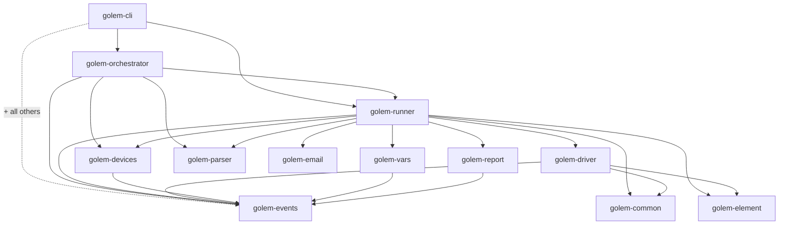
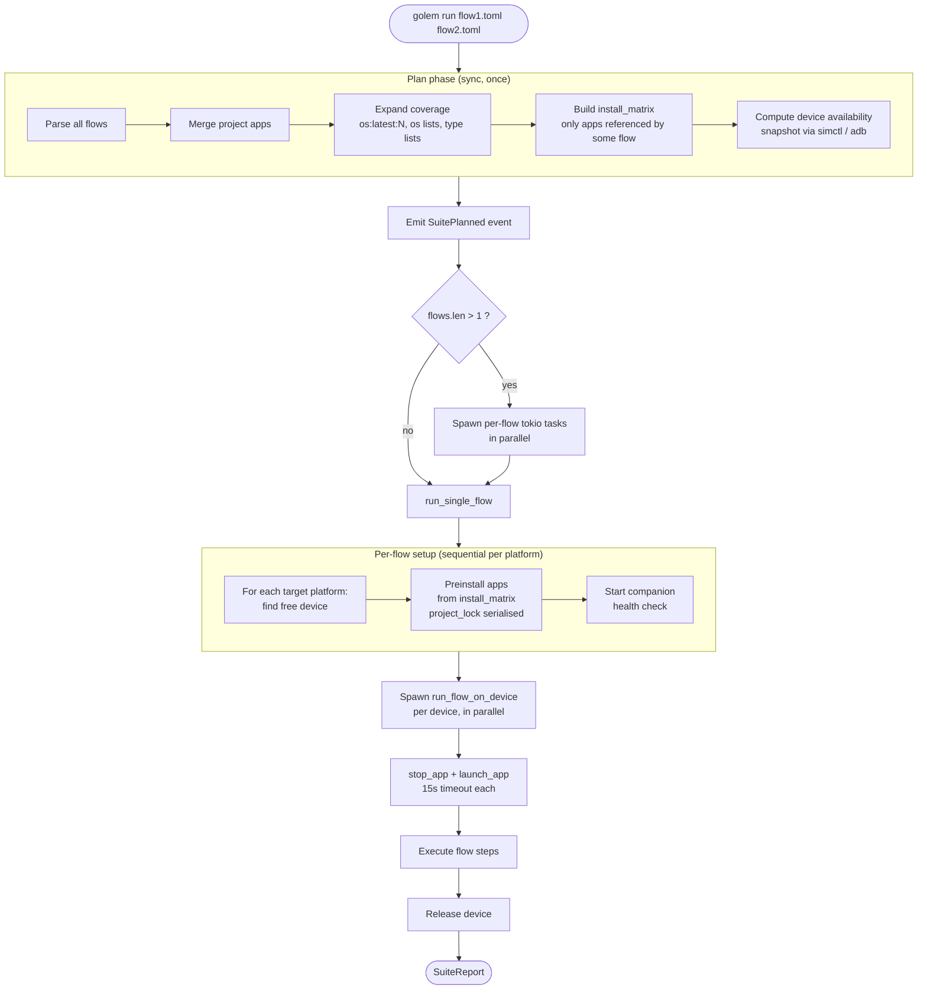

# Architecture

← [Back to README](../README.md) · See also [Companions](companions.md) · [Contributing](contributing.md)

golem is a Cargo workspace of focused crates. The CLI wires them together; a TOML flow flows through parsing → planning → execution → reporting, with platform work pushed down into the driver and its on-device [companions](companions.md).

## Crate map

| Crate | Responsibility |
|-------|----------------|
| `golem-cli` | Binary (`golem`). Arg parsing (clap, `src/cli.rs`), command dispatch (`run`, `tree`, `devices`, `init`, `create`, `install-script`), and the build script (`build.rs`) that compiles + caches the companions. Wires every other crate together. |
| `golem-orchestrator` | The Plan → Execute model. Plan phase: parse flows, merge project apps, expand coverage (`coverage`), build the install matrix (`install_matrix`). Owns suite-level scheduling. |
| `golem-runner` | Per-flow execution. Action handlers (`actions.rs` + `actions/`), block branching, subflows, data-driven/`for_each` loops, scrolling, install/cleanup/teardown, perf capture, source fingerprinting for the install cache. |
| `golem-driver` | Host-side device control + companion protocol. Per-platform modules (`android`, `ios`), WebView enrichment (`cdp` for Android, `webkit` for iOS), the Android custom-IME lifecycle (`ime`), and shared request/response DTOs (`common`). |
| `golem-element` | The `Element` model, the `Selector` type, glob matching, and trait predicates (`button`, `short_text`, `large`, …). |
| `golem-parser` | TOML test-file parsing and validation: flow/block/step structs (`lib.rs`), project config (`config`), fixtures, mixins, and validation. |
| `golem-devices` | Device discovery and lifecycle across simulators/emulators/physical devices (`android`, `ios`, `resolver`, `resource_manager`, `lifecycle`, boot/`settings`/`version`). |
| `golem-vars` | Variable store, interpolation, and the `fake:` data generators (`generators`, `geo`, `structured`, `seed` for deterministic replay). |
| `golem-report` | Output formats and result accumulation: `human`, `json`, `junit`, `toon`, plus the streaming reporter and flake summary. |
| `golem-events` | Structured event stream that carries the suite narrative, plus the failure-code system (`code` — see [Error Codes](error-codes.md)). |
| `golem-email` | IMAP polling behind the `await_email` action. |
| `golem-common` | Tiny shared helpers (e.g. the global debug flag). |

### Dependency graph

Intra-workspace edges only (each crate also pulls external deps). `golem-cli` sits on top and depends on all the others; the foundation crates (`golem-events`, `golem-element`, `golem-parser`, `golem-common`, `golem-email`) have no intra-workspace deps.

## How a suite runs

golem orchestrates a run in two phases. The **Plan** phase is sync and pure — it parses flows and computes what needs to happen. The **Execute** phase is async — it acquires devices, installs/launches apps via companions, and runs steps.

Plan lives in `golem-orchestrator` (`plan`, `coverage`, `install_matrix`); per-flow and per-step execution lives in `golem-runner`; device acquisition in `golem-devices`; and the on-device step work goes through `golem-driver` to the [companions](companions.md). Throughout, `golem-events` carries the narrative that `golem-report` renders.

## Visibility model — the visible tree decides coverage, the full tree only hints

A load-bearing invariant that is easy to forget when touching scrolling, selectors, or assertions:

- **The visible (filtered) tree is the source of truth for everything the test targets or asserts.** golem tests like a human: it taps, scrolls to, reads, and asserts against *only what is actually on screen*. The visible tree is produced by `filter_viewport`, which filters on each element's **`effective_bounds()`** — `visible_bounds` (the rectangle **clipped to ancestor containers**) when present, else raw `bounds` (`golem-element/src/lib.rs`).
  - **Webviews** populate `visible_bounds` via **IntersectionObserver** (`golem-driver/src/dom_traversal.js`): the post-clip intersection rect. An item scrolled out of an `overflow:hidden`/`auto` container gets a zero-area `visible_bounds` and is correctly **absent** from the visible tree — so it can't be tapped or satisfy `assert_visible`, exactly as a human can't see it. `getBoundingClientRect()` alone would wrongly report it as on-screen.
  - **Native** companions clip `visible_bounds` to ancestor containers the same way, so the model is platform-agnostic.

- **The full (unfiltered) tree is for *hints only* — it must never decide pass/fail or coverage.** Raw `bounds` for off-screen / clipped elements are legitimate input for *guesses* that make a test faster or smarter but don't change its outcome: e.g. inferring auto-scroll direction (is the target above or below?), the overshoot-reversal hint in `golem-runner/src/scroll.rs`, and settle/idle fingerprinting. If a code path reads the full tree to decide whether a step *succeeded*, that's a bug — it would pass on elements the user can't see.

When in doubt: **resolve and assert on the visible tree; reach for the full tree only to speed up or steer, never to judge.**

## Where things live

| To change… | Look in |
|---|---|
| An action's behaviour | `golem-runner/src/actions.rs` (dispatch match) + `golem-runner/src/actions/*.rs` (handlers) |
| Selectors / traits | `golem-element/src/selector.rs` |
| Platform device control / companion protocol | `golem-driver/src/` — `android.rs`, `ios*`, `ime.rs`, `cdp.rs`, `webkit.rs`, `common.rs` |
| Device discovery / boot | `golem-devices/src/` |
| TOML schema / parsing | `golem-parser/src/lib.rs`, `config.rs` |
| Variables / `fake:` generators | `golem-vars/src/` |
| Output formats | `golem-report/src/` |
| Event types / failure codes | `golem-events/src/` (`code.rs` for codes) |
| Suite planning / coverage | `golem-orchestrator/src/` |
| CLI commands / flags | `golem-cli/src/cli.rs` |
| Companion (on-device) code | `companions/ios/`, `companions/android/` — see [Companions](companions.md) |

> The reference docs for actions, the CLI, and selectors duplicate facts that live in these files. Pointer comments at each source flag the docs that need updating in tandem, and a unit test (`actions_reference_doc_lists_every_action` in `golem-runner/src/actions.rs`) fails if the action list and [Actions Reference](actions-reference.md) drift apart.
