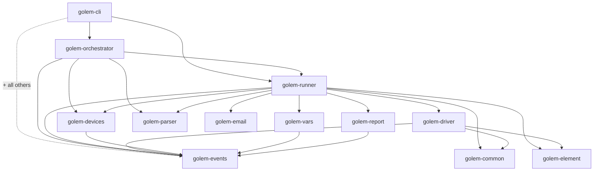
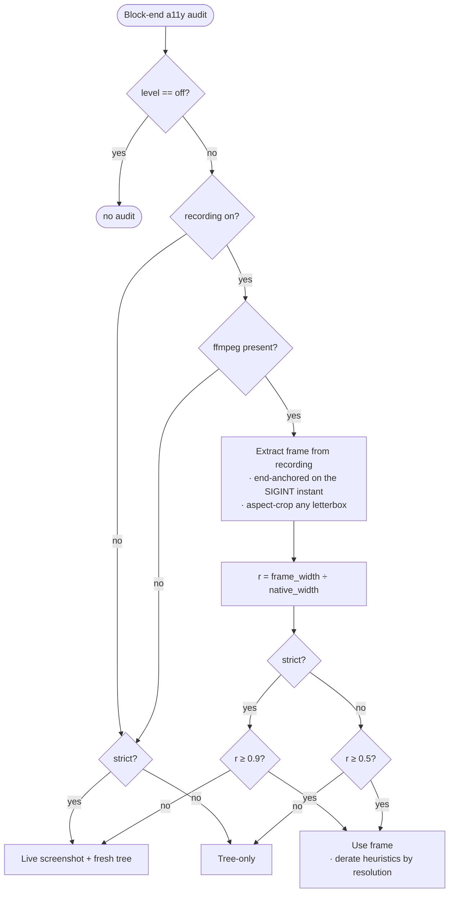
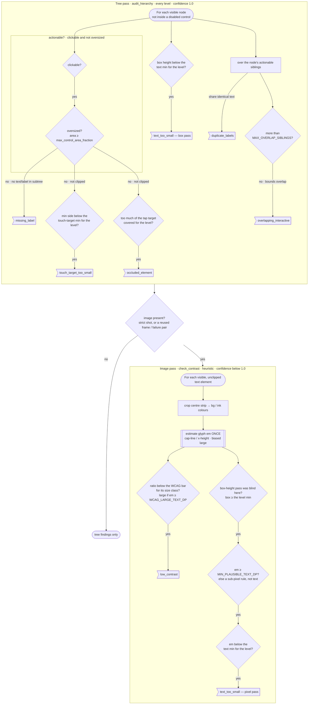

# Architecture

← [Back to README](../README.md) · See also [How golem sees the screen](how-golem-sees.md) · [Companions](companions.md) · [Contributing](contributing.md)

golem is a Cargo workspace of focused crates. The CLI wires them together; a TOML flow flows through parsing → planning → execution → reporting, with platform work pushed down into the driver and its on-device [companions](companions.md).

## Crate map

| Crate | Responsibility |
|-------|----------------|
| `golem-cli` | Binary (`golem`). Arg parsing (clap, `src/cli.rs`), command dispatch (`run`, `tree`, `devices`, `init`, `create`, `install-script`), and the build script (`build.rs`) that compiles + caches the companions. Wires every other crate together. |
| `golem-orchestrator` | The Plan → Execute model. Plan phase: parse flows, merge project apps, expand coverage (`coverage`), build the install matrix (`install_matrix`). Owns suite-level scheduling. |
| `golem-runner` | Per-flow execution. Action handlers (`actions.rs` + `actions/`), block branching, subflows, data-driven/`for_each` loops, scrolling, install/cleanup/teardown, perf capture, source fingerprinting for the install cache. |
| `golem-driver` | Host-side device control + companion protocol. Per-platform modules (`android`, `ios`), WebView enrichment (`cdp` for Android, `webkit` for iOS), the Android custom-IME lifecycle (`ime`), and shared request/response DTOs (`common`). |
| `golem-element` | The `Element` model, the `Selector` type, glob matching, and trait predicates (`button`, `short_text`, `large`, …). |
| `golem-parser` | TOML test-file parsing and validation: flow/block/step structs (`lib.rs`), project config (`config`), fixtures, mixins, and validation. |
| `golem-devices` | Device discovery and lifecycle across simulators/emulators/physical devices (`android`, `ios`, `resolver`, `resource_manager`, `lifecycle`, boot/`settings`/`version`). |
| `golem-vars` | Variable store, interpolation, and the `fake:` data generators (`generators`, `geo`, `structured`, `seed` for deterministic replay). |
| `golem-report` | Output formats and result accumulation: `human`, `json`, `junit`, `toon`, plus the streaming reporter and flake summary. |
| `golem-events` | Structured event stream that carries the suite narrative, plus the failure-code system (`code` — see [Error Codes](error-codes.md)). |
| `golem-email` | IMAP polling behind the `await_email` action. |
| `golem-common` | Tiny shared helpers (e.g. the global debug flag). |

### Dependency graph

Intra-workspace edges only (each crate also pulls external deps). `golem-cli` sits on top and depends on all the others; the foundation crates (`golem-events`, `golem-element`, `golem-parser`, `golem-common`, `golem-email`) have no intra-workspace deps.

## How a suite runs

golem orchestrates a run in two phases. The **Plan** phase is sync and pure — it parses flows and computes what needs to happen. The **Execute** phase is async — it acquires devices, installs/launches apps via companions, and runs steps.

Plan lives in `golem-orchestrator` (`plan`, `coverage`, `install_matrix`); per-flow and per-step execution lives in `golem-runner`; device acquisition in `golem-devices`; and the on-device step work goes through `golem-driver` to the [companions](companions.md). Throughout, `golem-events` carries the narrative that `golem-report` renders.

For a concrete, step-by-step walk-through of a single flow — how a step learns what's on screen, the companion handshake, webview enrichment, recording, and the block-end a11y audit, as sequence diagrams — see [How golem sees the screen](how-golem-sees.md).

## Visibility model — the visible tree decides coverage, the full tree only hints

A load-bearing invariant that is easy to forget when touching scrolling, selectors, or assertions:

- **The visible (filtered) tree is the source of truth for everything the test targets or asserts.** golem tests like a human: it taps, scrolls to, reads, and asserts against *only what is actually on screen*. The visible tree is produced by `filter_viewport`, which filters on each element's **`effective_bounds()`** — `visible_bounds` (the rectangle **clipped to ancestor containers**) when present, else raw `bounds` (`golem-element/src/lib.rs`).
  - **Webviews** populate `visible_bounds` via **IntersectionObserver** (`golem-driver/src/dom_traversal.js`): the post-clip intersection rect. An item scrolled out of an `overflow:hidden`/`auto` container gets a zero-area `visible_bounds` and is correctly **absent** from the visible tree — so it can't be tapped or satisfy `assert_visible`, exactly as a human can't see it. `getBoundingClientRect()` alone would wrongly report it as on-screen.
  - **Native** companions clip `visible_bounds` to ancestor containers the same way, so the model is platform-agnostic.

- **The full (unfiltered) tree is for *hints only* — it must never decide pass/fail or coverage.** Raw `bounds` for off-screen / clipped elements are legitimate input for *guesses* that make a test faster or smarter but don't change its outcome: e.g. inferring auto-scroll direction (is the target above or below?), the overshoot-reversal hint in `golem-runner/src/scroll.rs`, and settle/idle fingerprinting. If a code path reads the full tree to decide whether a step *succeeded*, that's a bug — it would pass on elements the user can't see.

When in doubt: **resolve and assert on the visible tree; reach for the full tree only to speed up or steer, never to judge.**

## Occlusion & hit-testing

`filter_viewport` drops what's clipped or off-screen, but not what's *covered* by a later-painted sibling (a sticky header, a `z-index` overlay). golem hit-tests sample points within an element's visible bounds and routes a tap to the first clear one (centre → arms → corners), falling back to the centre if none is clear — a heuristic that never blocks the tap. The user-facing behaviour is in [Selectors → occlusion-aware tapping](selectors.md#occlusion-aware-tapping); the platform mechanics:

- **Webview targets** use `document.elementFromPoint` (`golem-driver/src/dom_traversal.js`) — the browser's own paint-order hit-test.
- **Native targets** use a host-side geometric hit-test against the tree's paint order: sibling `getDrawingOrder` on Android (captures Material elevation that raw tree order misses), tree order on iOS. Cross-hierarchy elevation and iOS `zPosition` aren't captured, so a reported occlusion means *"may be covered"*, not a certainty.

Android's accessibility framework already prunes nodes whose bounds are fully occluded (a covered label disappears from the tree) and may trim an interactive's reachable region, so the host hit-test mostly adds value where the platform keeps a covered element at full bounds. The a11y audit's `occluded_element` check reuses these same hit-test samples (see [Accessibility audit](#accessibility-audit--frame-sourcing-and-the-check-pipeline)).

## Accessibility audit — frame sourcing and the check pipeline

### Frame sourcing — recording vs live screenshot vs tree-only

The a11y audit at each block boundary needs a `(tree, image)` pair for the pixel checks (contrast, the `strict` glyph-size pass) and the annotated PNG. Capturing a fresh screenshot every block is expensive, so the audit prefers a frame already on disk — the **block recording** — and only falls back to a live capture when it must. The decision tree (`compute_a11y_audit` selection in `golem-runner/src/executor.rs`):

Three subtleties make the recording frame trustworthy enough to judge pixels on (all are easy to regress):

- **The end is anchored on the *SIGINT instant*, not on `stop_recording` returning.** `stop_recording` sends the on-device stop signal, then sleeps for the moov-atom flush and pulls the file (~1s on Android). If we timestamped the end *after* that, the offset would rewind the extracted frame ~1s back — straight into the previous step's motion (a mid-scroll frame paired with a settled tree → wrong pixel crops). So each driver stamps the true end inside `stop_recording` right after the signal (`PlatformDriver::last_recording_end`), and `executor.rs` anchors frame extraction on that. Robust to variable adb roundtrip on real devices.
- **Frames are aspect-cropped.** When an encoder can't record native resolution it scales the display into a fixed box (e.g. Android's fallback to 720×1280), letterboxing a device of a different aspect. Bars would break the geometry mapping (`screenshot_px ÷ viewport_width`), so `capture.rs::aspect_crop_frame` removes them deterministically from the device-vs-frame aspect ratio (no pixel inspection; a no-op when the frame already fills). Android also requests an aspect-correct, capped `--size` up front (`AndroidDriver::recording_size`) to avoid the letterbox entirely and lift resolution; iOS `simctl` records native.
- **Confidence is de-rated by `r`, the resolution ratio.** A full-resolution frame (`r ≈ 1`) is indistinguishable from a live shot and gains the no-timing-drift bonus, so it's barely de-rated; lower `r` de-rates the heuristic findings convexly (`golem-runner/src/executor.rs::video_confidence_factor`). Deterministic findings (bounds/structure) are never de-rated.

The **failure** path is separate: a failing step already captured a real live `(screenshot, tree)`, which the audit reuses directly at full confidence — no recording involved.

### The check pipeline — a tree pass and an image pass

Once the audit has a tree (and maybe an image), the checks run in two passes. The **tree pass** (`audit_hierarchy`) runs at every level from bounds + structure alone, so its findings are deterministic (confidence `1.0`). The **image pass** (`check_contrast`) runs only when an image is present and is heuristic (confidence `< 1.0`). `text_too_small` deliberately spans both: a *certain* box-height check in the tree pass, plus a *pixel* refinement in the image pass for small glyphs inside a tall/padded box the box check can't see.

The single `em` estimate is the load-bearing reuse: it picks the contrast size-class (large text is judged at the laxer AA/AAA bars) **and** drives the pixel `text_too_small` pass — one sound glyph-height read rather than two competing proxies. Both the contrast crop and the pixel pass skip **clipped** elements (a sliver would sample the wrong colours and a fraction of the glyphs); the size-independent tree checks still cover them. See [accessibility.md](accessibility.md) for the user-facing levels, thresholds, and confidence model.

## Where things live

| To change… | Look in |
|---|---|
| An action's behaviour | `golem-runner/src/actions.rs` (dispatch match) + `golem-runner/src/actions/*.rs` (handlers) |
| A11y checks / frame sourcing | `golem-runner/src/accessibility.rs` (the checks) + `executor.rs` (level→source decision, derate) + `capture.rs` (recording-frame extract, aspect-crop) |
| Selectors / traits | `golem-element/src/selector.rs` |
| Platform device control / companion protocol | `golem-driver/src/` — `android.rs`, `ios*`, `ime.rs`, `cdp.rs`, `webkit.rs`, `common.rs` |
| Device discovery / boot | `golem-devices/src/` |
| TOML schema / parsing | `golem-parser/src/lib.rs`, `config.rs` |
| Variables / `fake:` generators | `golem-vars/src/` |
| Output formats | `golem-report/src/` |
| Event types / failure codes | `golem-events/src/` (`code.rs` for codes) |
| Suite planning / coverage | `golem-orchestrator/src/` |
| CLI commands / flags | `golem-cli/src/cli.rs` |
| Companion (on-device) code | `companions/ios/`, `companions/android/` — see [Companions](companions.md) |

> The reference docs for actions, the CLI, and selectors duplicate facts that live in these files. Pointer comments at each source flag the docs that need updating in tandem, and a unit test (`actions_reference_doc_lists_every_action` in `golem-runner/src/actions.rs`) fails if the action list and [Actions Reference](actions-reference.md) drift apart.
