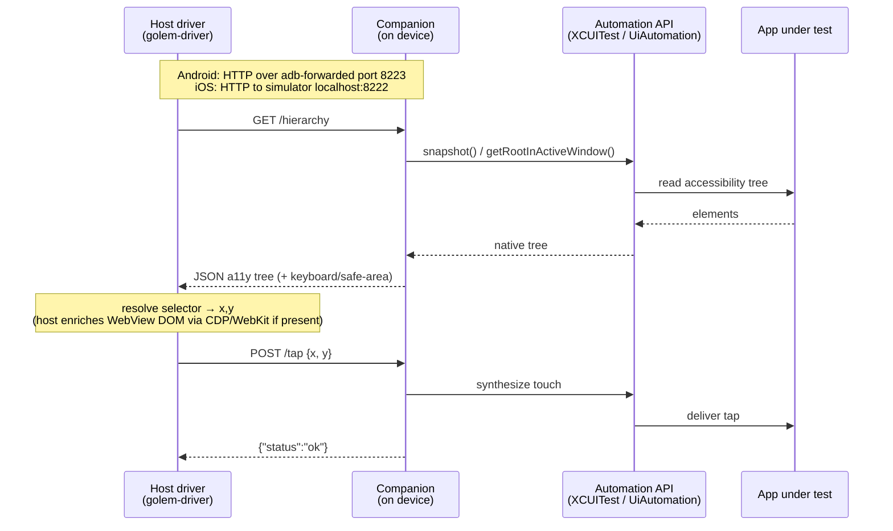

# Companions

*The golem needs hands inside the device. Companions are those hands.*

← [Back to README](../README.md) · See also [Architecture](architecture.md) · [Versioning](versioning.md)

A **companion** is a small agent golem installs on the target device. The host-side driver
cannot reach an app's UI directly — only the OS's own automation framework can. So golem ships
one companion per platform that wraps that framework and exposes it over a tiny HTTP/JSON
protocol. The driver speaks the same protocol to both, and the platform differences live inside
the companion.

## Overview

Every action golem performs flows through three layers:

```text
host driver  ⇄  on-device companion  ⇄  app under test
(golem-driver)   (XCUITest / UiAutomation)   (your app)
```

- **Host driver** (`golem-driver/`) — runs on your machine. Builds requests (tap at x/y, fetch
  the UI tree, type text), sends them to the companion, normalizes the response into golem's
  `Element` tree, and runs device-level operations (launch, permissions, location) via `adb` /
  `xcrun simctl`.
- **Companion** — runs *on the device/simulator*. Receives HTTP requests and translates them
  into native automation calls (XCUITest on iOS, `UiAutomation` on Android), then serializes the
  accessibility tree back as JSON.
- **App under test** — your application. It is never modified or instrumented; the companion
  drives it from the outside through the OS automation API.

There is one companion per platform because each speaks a different native automation framework.
The wire protocol (the `/hierarchy`, `/tap`, `/type`… endpoints) is deliberately identical, so
`golem-driver` shares request/response DTOs across both (`golem-driver/src/common.rs`).

## iOS companion

*Source: `companions/ios/`.*

The iOS companion is an **XCUITest** harness — it runs as a UI-test process and uses XCUITest to
read and drive the app. Its pieces:

| File | Role |
|------|------|
| `GolemRunnerUITests/HTTPServer.swift` | BSD-socket HTTP/1.1 server on a background thread |
| `GolemRunnerUITests/RequestRouter.swift` | Dispatches requests to XCUITest actions |
| `GolemRunnerUITests/HierarchySerializer.swift` | XCUIElement snapshot → JSON a11y tree |
| `GolemRunnerUITests/GestureSynthesizer.{h,m}` | Multi-touch gestures (private XCTest APIs) |
| `GolemRunnerUITests/SnapshotHelper.{h,m}` | Obj-C bridge for private snapshot props + NSException catching |

**Transport.** `HTTPServer.swift` opens a plain BSD socket and serves HTTP/1.1 on a background
thread (default port **8222**; overridable via `GOLEM_PORT`, or dynamically assigned by posting
to a host registration server when `GOLEM_REG_PORT` is set). Because the companion runs inside
the simulator, the host driver reaches it directly on `http://localhost:8222` — no port
forwarding needed.

**Requests.** `RequestRouter` maps each path to an XCUITest action and returns JSON (or PNG for
screenshots). Endpoints include `/health`, `/hierarchy`, `/tap`, `/longpress`, `/type`,
`/backspace`, `/swipe`, `/pinch`, `/gesture`, `/screenshot`, `/hide-keyboard`, `/press`,
`/launch`, `/stop`. XCUITest calls must run on the main thread, so each handler dispatches onto
main with a semaphore-backed timeout watchdog (returning `504` if a call wedges) — one stuck
request can't block the rest.

**The a11y tree.** `/hierarchy` calls `HierarchySerializer.serialize(app:)`, which walks the
`XCUIElementSnapshot` and emits a JSON tree of nodes (`element_type`, `text`, `label`, `value`,
`id`, `enabled`, `checked`, `focused`, `bounds`, `visible_bounds`, `children`). The response also
carries layout context the driver needs: `keyboard_height`, `safe_area_top`/`bottom`, and
`device_model`. HTML inside a `WKWebView` shows up through WebKit's accessibility properties (see
[WebView handling](#webview-handling)).

**Build & install.** The companion is compiled during `cargo build` of `golem-cli`
(`golem-cli/build.rs`): it hashes the iOS sources (plus the crate version) and, on change, runs
`xcodebuild build-for-testing` for the simulator, then packages the products + `.xctestrun` into
a cached `companion-ios.tar.gz` that the CLI installs onto the simulator at run time.

## Android companion

*Source: `companions/android/`.*

On Android the companion lives in the **`androidTest` APK** (an instrumentation test), which is
what grants it access to `UiAutomation`.

| File | Role |
|------|------|
| `app/src/androidTest/java/fail/golem/companion/CompanionServer.java` | Java-socket HTTP/JSON server + UiAutomation calls |
| `app/src/main/java/fail/golem/companion/GolemImeService.java` | Custom input method for text entry |
| `app/src/main/res/xml/method.xml` | Registers the IME subtype |
| `app/src/main/AndroidManifest.xml` | Declares the IME service |

**Transport.** `CompanionServer.java` is a minimal HTTP server built on raw Java sockets (no
framework), default port **8223**. The device is remote, so the host sets up
`adb forward tcp:8223 tcp:8223` and reaches the companion on `http://localhost:8223`. As on iOS,
the port can instead be assigned via the host registration server. It serves the same endpoint
set as iOS, plus `/perf`.

**The a11y tree.** `/hierarchy` calls `UiAutomation.getRootInActiveWindow()` and recursively
serializes the accessibility node tree into the same JSON node shape the driver expects, with
visible bounds computed by intersecting up the parent chain.

**UiAutomation is a contended, single resource.** There is exactly one `UiAutomation` handle, and
it can wedge. The companion is built around that constraint:

- All `UiAutomation` calls serialize through a **single bounded executor thread**
  (`golem-ui-bounded`) with a hard per-call timeout — **no per-handler background a11y polling
  loops**; the tree is fetched once per `/hierarchy` request.
- If the handle goes stale (a sustained run of `null` returns), the companion **self-exits**;
  instrumentation auto-restarts, the host's recovery sees the unresponsive signal, and the
  companion re-registers with a fresh handle.

**Custom IME for text input.** `adb shell input text` is ASCII-only, so golem ships
`GolemImeService` — a headless input method — to commit arbitrary Unicode. The host enables and
selects it for the session, then sends text via an ordered broadcast (base64-UTF-8 payload); the
service writes it through the standard `InputConnection.commitText`, which works for native
`EditText`s *and* WebView inputs. The IME never shows a keyboard view. ASCII text still takes the
fast `/type` (`input text`) path; only non-ASCII routes through the IME.

`method.xml` declares a single generic subtype so `ime enable` / `ime set` can target it on all
API levels, and `AndroidManifest.xml` declares the service with the
`android.permission.BIND_INPUT_METHOD` permission and the `android.view.InputMethod` intent
filter. The host-side lifecycle (enable, set, commit, restore the original IME at teardown) lives
in `golem-driver/src/ime.rs`.

## WebView handling

Neither companion speaks the DevTools protocol — they return only the native accessibility tree.
WebView enrichment happens **entirely on the host**, where the driver fetches the live DOM and
merges it into the WebView node's bounds so web content becomes addressable like native UI.

- **Android — Chrome DevTools Protocol** (`golem-driver/src/cdp.rs`). The driver discovers the
  WebView's debug socket (`/proc/net/unix`), sets up
  `adb forward tcp:<port> localabstract:<socket>`, connects over WebSocket, and runs a DOM
  traversal via `Runtime.evaluate`. Bounds are scaled by device pixel ratio and offset by the
  WebView's on-screen position.
- **iOS — WebKit Inspector Protocol** (`golem-driver/src/webkit.rs`). The driver connects to the
  simulator's `webinspectord` Unix domain socket and exchanges binary-plist RPC to fetch the
  `WKWebView` DOM, then offsets it by the WebView position (and safe-area top).

Both use lazy background setup: the first time a WebView appears in the hierarchy, the driver
kicks off the connection in the background and enriches subsequent `/hierarchy` results once it's
ready.

## Request flow

For a single step (e.g. "tap the Login button"), the driver fetches the hierarchy to resolve the
selector to coordinates, then issues the action. Transport differs by platform: Android goes
through an `adb`-forwarded port; iOS talks to the simulator's localhost directly.



Device-level operations (launch, force-stop, permissions, location, video) bypass the companion
and run as `adb shell …` (Android) or `xcrun simctl …` (iOS) from the host.

## Health checks & versioning

Each companion exposes **`GET /health`** returning JSON:

```json
{
  "status": "ok",
  "platform": "android",
  "version": "0.6.32",
  "device_name": "...",
  "device_model": "...",
  "os_version": "...",
  "device_id": "..."
}
```

The driver polls this on startup (`golem-driver/src/common.rs::check_health` / `wait_for_health`)
until the companion is reachable. On Android the handler first probes `UiAutomation`; until that
binding is ready it returns **`503`** with `status: "warming_up"`, so the driver waits for the
companion to actually be able to drive the app, not just accept sockets.

The `version` field is carried specifically so the host can confirm the running companion matches
the host's version — a stale companion left over from a previous build would otherwise answer
with an outdated protocol. The version string is **not** auto-derived from `Cargo.toml`; it is
written into the companions by hand (in `RequestRouter.swift`'s `handleHealth`, `CompanionServer`'s
`/health` handler, and the companion test files). [Versioning](versioning.md) lists every
location and the bump script keeps them in sync.

> The exact host↔companion version comparison lives in the health-check/runner layer, not in
> `golem-driver` itself — the driver's job is to read and surface the `version` field.

## How to modify a companion

1. **Find the code.** iOS: `companions/ios/GolemRunnerUITests/`. Android:
   `companions/android/app/src/androidTest/java/fail/golem/companion/` (server) and
   `app/src/main/java/fail/golem/companion/` (IME).
2. **Test iOS Swift logic.** Swift changes are **not** covered by `cargo t` (nextest doesn't run
   Swift). Run the Swift Testing suite on a simulator:
   ```bash
   ./scripts/test-ios-companion.sh
   ```
3. **Bump the version.** Any companion change requires a version bump — this updates the hardcoded
   `version` strings and, crucially, invalidates the install cache so the new companion is rebuilt
   and reinstalled instead of a stale one being reused:
   ```bash
   ./scripts/bump-version.sh --patch
   ```
4. **Run the matrix.** Companion changes require running e2e on the affected platform(s) and a
   version bump — see the change-type matrix in [Contributing](contributing.md) for exactly
   what to run before committing.
