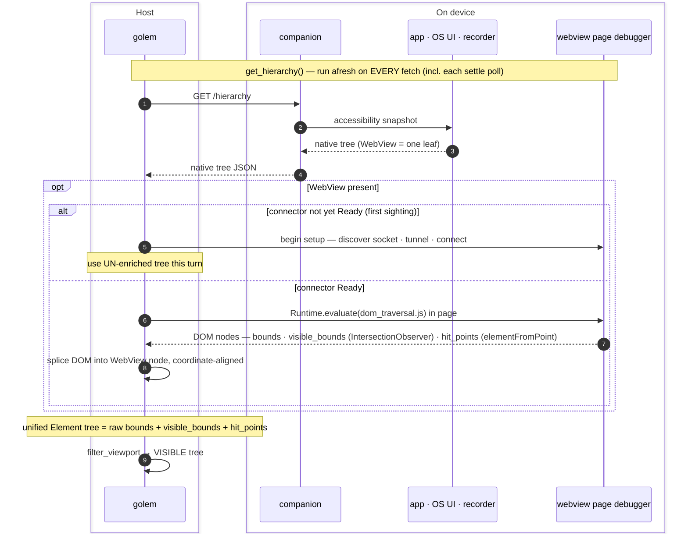
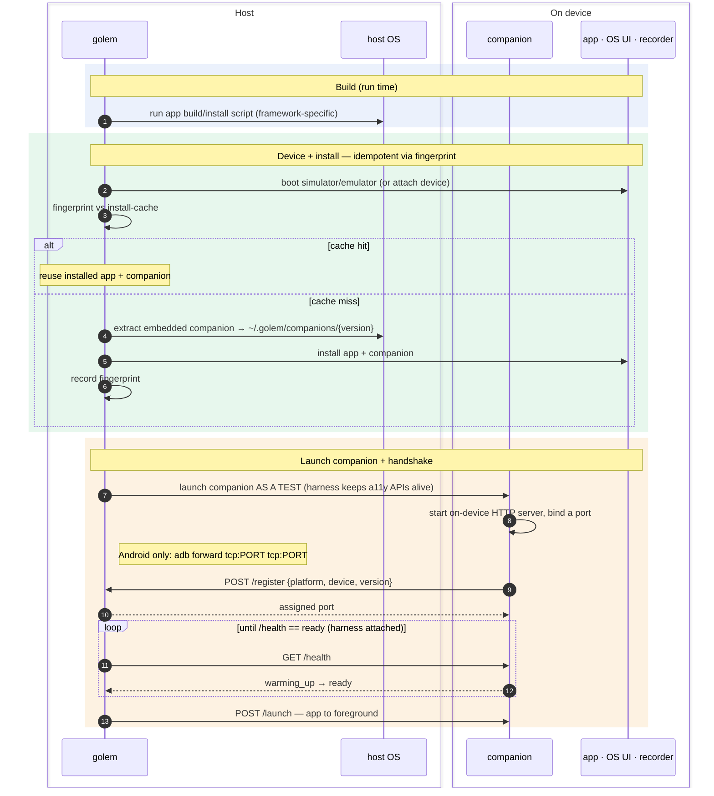
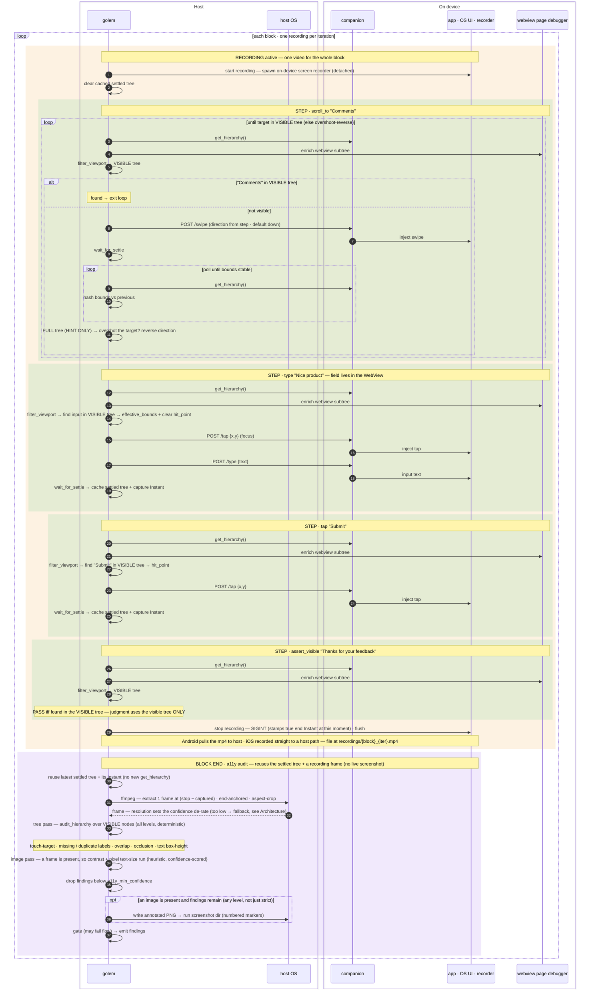
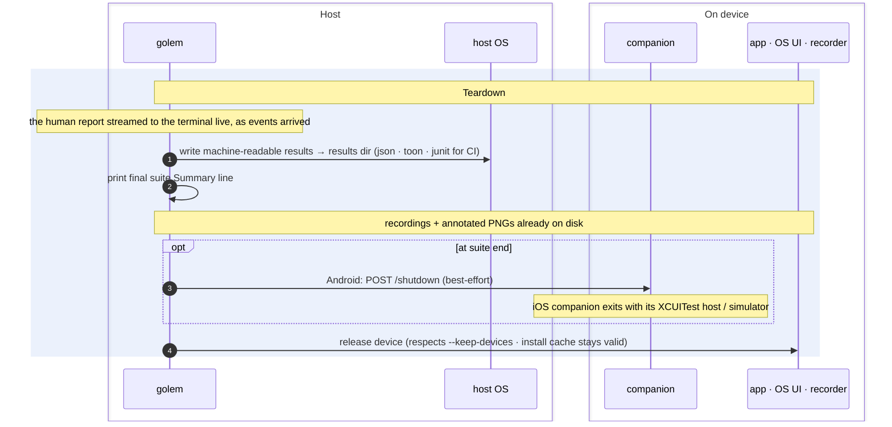

# How golem sees the screen — one flow, end to end

← [Back to Architecture](architecture.md) · See also [Companions](companions.md) · [Accessibility](accessibility.md)

A narrative walk-through of everything that happens when golem runs a single flow: how it learns what's on screen, how it treats that like a human would, and where the on-device **companion** fits. It complements the [Architecture](architecture.md) overview — see [Visibility model](architecture.md#visibility-model--the-visible-tree-decides-coverage-the-full-tree-only-hints) for *why* the visible tree is the source of truth, and [Accessibility audit](architecture.md#accessibility-audit--frame-sourcing-and-the-check-pipeline) for the frame-sourcing detail summarised here.

The engineering problem in one sentence: **answer "what does a human see right now, and can I touch it?" — on two different OS UI stacks, across native *and* webview content, over a flaky async link to a device** — and never let anything the user can't see decide pass/fail.

## The cast (lanes)

The same participants appear, in the same order, in every diagram below; a diagram omits a lane only when it plays no part in that phase. The **host ↔ device boundary** is the async link everything is organised around.

| Lane | Where | Role |
|------|-------|------|
| **golem** | host | The `golem` CLI process. Orchestrates the run and owns the `resolve → act → settle → assert` step loop, visibility filtering, the a11y audit, and reporting. |
| **host OS** | host | Subprocesses and files golem shells out to that *don't* touch the device: the app build/install script, extracting the embedded companion, and `ffmpeg` frame extraction. |
| **companion** | on device | An on-device HTTP server — shipped **embedded in the `golem` binary**, launched *as a test* — that snapshots the UI and injects input. |
| **app · OS UI · recorder** | on device | The actual screen, the OS accessibility APIs, and the OS screen recorder. |
| **webview page debugger** | on device | The page's own debugger (CDP / WebKit Inspector) — a **separate channel** from the companion, used only for web content. |

## Assumptions

This walk-through is the **happy path** with the settings that exercise the most machinery:

- **No failures, retries, or timeouts** — every step resolves and settles on the first try, and every device call returns within its deadline.
- **Recording is on** (`--record` or `--trace`) and **`ffmpeg` is installed**.
- **Accessibility auditing is enabled** (`relaxed` or higher). The annotated PNG is written at *any* level when a frame is available and findings remain — `strict` just additionally *forces* a screenshot and surfaces the heuristic contrast / pixel-text findings.
- **The form field lives in a WebView**, so the DOM-enrichment path is exercised.
- **One block, one iteration** — the diagrams show the surrounding loops for generality.
- **A simulator/emulator** — on-device screen recording of a physical iOS device is not supported.
- **Generic platform terms** throughout; only genuinely platform-specific mechanics (e.g. Android's `adb forward`) are called out.

## The flow

The whole test the user writes is four steps — **scroll to the comment field, type into it, submit, assert the confirmation**:

```toml
[[block]]
name = "submit_feedback"
steps = [
  { action = "scroll",         to = { text = "Comments" } },
  { action = "type",           on_text = "Comments", input = "Nice product" },
  { action = "tap",            on_text = "Submit" },
  { action = "assert_visible", on_text = "Thanks for your feedback" },
]
```

Everything in the diagrams below is what golem *does* to run those four lines: bring up the device, and for each step figure out what's on screen, act on it, wait for it to settle, and — because recording and a11y are on — record the block and audit it at the end.

## The `get_hierarchy` unit

Every step's knowledge of the screen comes from **one reusable unit**, run afresh on *every* fetch (including each poll of a settle loop):

1. **Native fetch.** golem asks the companion (`GET /hierarchy`); the companion snapshots the OS accessibility tree and returns it as JSON. A WebView shows up here as a **single opaque leaf**.
2. **Webview enrichment (only if a WebView is present).** golem talks to the **page's own debugger** — a different endpoint from the companion — and runs an injected `dom_traversal.js` in the page. The **first time** a webview appears the connector is still warming up, so that turn returns the **un-enriched** tree; once the connector is `Ready`, the DOM is spliced into the WebView node, coordinate-aligned, giving **one unified tree**. The DOM nodes carry `visible_bounds` (post-clip, via `IntersectionObserver`) and `hit_points` (via `elementFromPoint`).
3. **Filter to the visible tree.** golem runs `filter_viewport` to reduce the unified tree to only what's actually on screen — [the tree that judges](architecture.md#visibility-model--the-visible-tree-decides-coverage-the-full-tree-only-hints).

The diagram below shows the unit in full. In the **Flow** section every step then calls it **compactly** — drawn as just the lanes it touches (`companion` for the native tree, `webview page debugger` for enrichment, then `golem` filters to the visible tree) — because it's the same sequence each time.



## 1 · Setup

Build → install → launch → handshake. The one idea that surprises people: **the companion is launched *as a test*** — the UI-test / instrumentation harness is the only sanctioned way to reach the accessibility APIs, so golem parks a never-ending "test" that is really a server.



## 2 · Flow

The step loop, bracketed by the block recording and followed by the block-end a11y audit. Three distinctions to hold onto while reading:

- **Hint vs judge.** Whether the target is *found* is decided only on the **visible** tree. The swipe direction is static (from the step, default `down`); the **full** tree is consulted only as a hint — to detect *overshoot* (did we scroll past the target?) and reverse. It never decides pass/fail.
- **The webview detour.** For web content golem stops talking to the companion and talks to the **page's debugger** directly — and the first sighting costs a turn to warm up.
- **Recording is a bracket, ffmpeg is not a camera.** The OS records the screen for the whole block; when the block ends the recording is **stopped first**, then `ffmpeg` merely **extracts one still frame** from the finished file at the instant the audited tree was captured. It never captures the video.
- **The a11y audit reuses, it doesn't re-observe.** At block end golem audits the *last settled visible tree* against that extracted frame — no extra `get_hierarchy`, no live screenshot. Tree-shape checks are deterministic; the image checks (contrast, pixel text-size) are heuristic and de-rated by the frame's resolution, then dropped below `a11y_min_confidence`. The full frame-sourcing and check-pipeline decision trees live in [Architecture](architecture.md#accessibility-audit--frame-sourcing-and-the-check-pipeline).



## 3 · Teardown

The human report has been streaming to the terminal all along — golem renders events **live as they arrive**, not at the end. Teardown is where the machine-readable results (json · toon, and junit for CI) get written to disk and the final suite `Summary` is printed; recordings and annotated PNGs are already on disk. The device is released; the install cache stays valid so a later run can skip the install.



## See also

- [Architecture](architecture.md) — crate map, Plan/Execute model, the [Visibility model](architecture.md#visibility-model--the-visible-tree-decides-coverage-the-full-tree-only-hints) and [Accessibility audit](architecture.md#accessibility-audit--frame-sourcing-and-the-check-pipeline) in depth.
- [Companions](companions.md) — the on-device iOS/Android harnesses.
- [Accessibility](accessibility.md) — user-facing a11y levels, checks, thresholds, and confidence.
